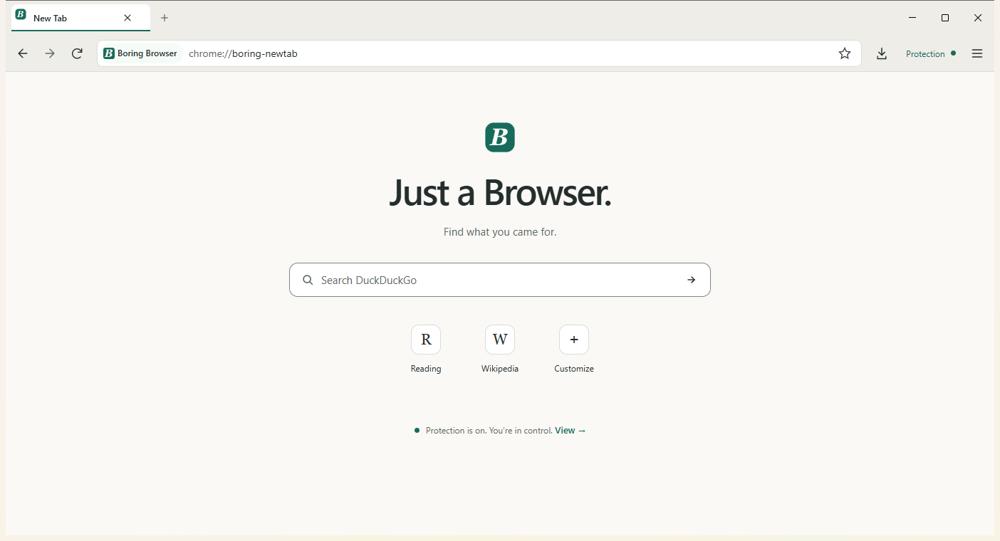
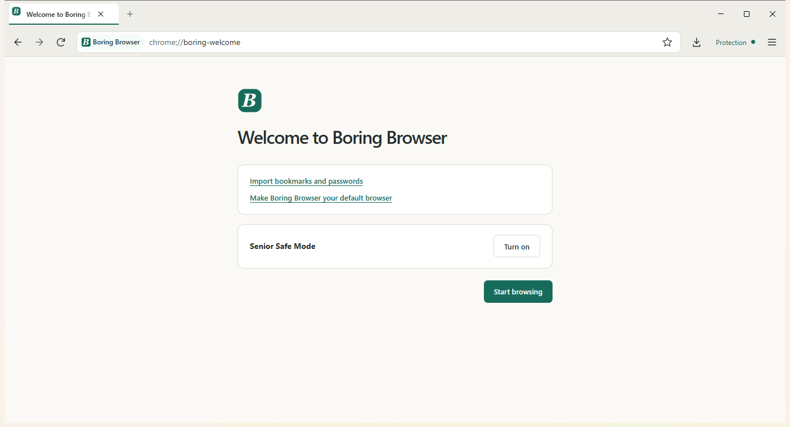
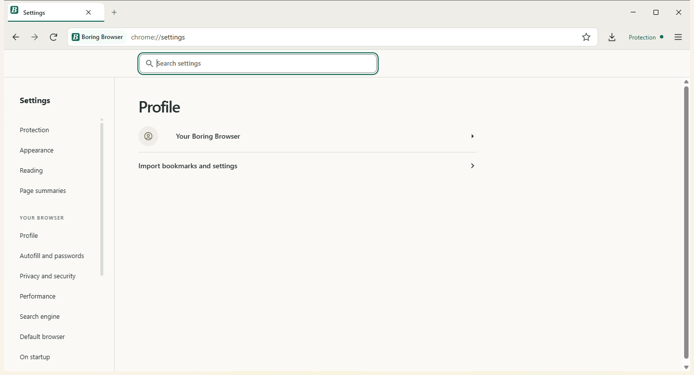
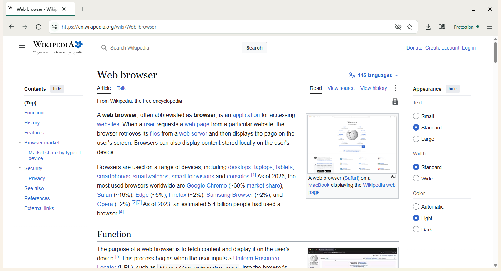

# the boring web browser

A plain, private Windows browser. It is Chromium's engine, de-Googled by
ungoogled-chromium, with a small patch layer on top for blocking, privacy
defaults and a calmer UI. It is not a new engine.

## Release 1

- Chromium 153.0.8010.52, via ungoogled-chromium 153.0.8010.52-1.1.
- Windows x64 only.
- Not code signed. SmartScreen will warn. Do not turn it off; check the
  SHA-256 from the release page instead.
- Downloads: the [release 1 page](https://github.com/JD-D3V/boring-web-browser/releases/tag/v153.0.8010.52.1),
  with the installer, the zip and `SHA256SUMS.txt`.

## On by default

- Ad, tracker and pop-up blocking.
- HTTPS first (Chromium's balanced mode).
- Quad9 secure DNS. Quad9 refuses known malware and phishing domains, so
  they do not open. There is no warning page, and new sites get through.
- WebRTC kept to proxied routes.
- Fingerprint noise on canvas, text measurement and element sizes.
- Tracking parameters removed from links to other sites. The list comes
  from Brave; `utm_` tags are kept.
- DuckDuckGo search, with a picker on the new tab page.
- Sponsored search results hidden on supported search pages.

Also there:

- Senior Safe Mode. One switch that keeps sponsored results hidden and
  asks before it can be turned off.
- Reader view from the toolbar.
- Page summaries, only on click. Off until you pick a provider. A remote
  provider receives the page text.
- Turn off blocking on one site from the toolbar shield. Chromium's own
  pop-up blocker stays on. The Protection page lists these sites.
- Chrome Web Store extensions. Every install asks first. The store helper
  ([chromium-web-store](https://github.com/NeverDecaf/chromium-web-store)
  1.5.5.4) is built in, can be removed, and changes only with a browser
  update. It asks Google's update service about your store extensions
  every 5 hours.
- Spellcheck with Windows' own checker, and a bundled English (US)
  dictionary as a fallback. No download.
- Import from Chrome or Edge: bookmarks, history and search engines you
  added. Never passwords or cookies.

## Updates

Installed copies check for a new release once a day, using WinSparkle
and a fixed feed at `https://jd-d3v.github.io/boring-web-browser/appcast.xml`. A new
release installs only after you agree, and only if it carries a valid
EdDSA signature from our key. A copy run from the zip does not update;
use the installer for updates. The daily check can be turned off on the
Protection page.

## Not in release 1

- Scam warning page and scam site list. No feed we may redistribute yet.
- Widevine, so no Netflix or other DRM video.
- Sync. `sync-server/` is a separate Go server the browser does not use.
- Tor windows.
- Code signing.
- Blocking list updates. The lists are the ones built in.

## Honest limits

- Nothing has been independently audited.
- Protection is not antivirus. Quad9 only knows reported sites.
- The network behaviour of each build is measured before release and
  listed on the project's privacy page. Sites you visit and your search
  engine are contacted as you browse.
- One person maintains this. There is no support promise and no fixed
  update schedule.

## What is ours and what is upstream

| Layer | Whose |
| --- | --- |
| Blink, V8, the sandbox, site isolation | Chromium, untouched |
| De-Googling | [ungoogled-chromium](https://github.com/ungoogled-software/ungoogled-chromium) |
| `boring-core/patches/` (37 patches) | Ours. UI shape, settings, new pages, privacy defaults, packaging |
| `boring-core/components/boring/` | Ours. Blocking, per-site blocking off, Protection page, new tab, welcome, reader, summaries, tracking parameters, updater glue, Chrome and Edge import, store helper setup |
| Store helper | [chromium-web-store](https://github.com/NeverDecaf/chromium-web-store) by NeverDecaf, bundled with its self-update address removed and its check interval set to 5 hours |
| `boring-core/rust/` | Ours. Wraps the third-party `adblock` crate |
| `boring-core/tools/` | Ours. Apply, rebase, smoke tests, packaging |

HTTPS-first, secure DNS, WebRTC routing and fingerprint noise are
Chromium and ungoogled-chromium features. Our part is turning them on by
default and showing them on the Protection page. The sandbox is never
turned off.

## Building

Windows only. Needs Visual Studio 2022 with C++, ATL and MFC, the Windows
11 SDK with Debugging Tools, Python 3.11+, Git, 7-Zip, ninja, Rust, and
about 100 GB free on an SSD.

1. Build [ungoogled-chromium-windows](https://github.com/ungoogled-software/ungoogled-chromium-windows)
   at tag `153.0.8010.52-1.1` with its own `build.py`.
   `--patch-set 153` below picks our patches rebased for Chromium 153.
2. Fetch the updater DLL, then apply our layer:

   ```
   python boring-core/tools/get_winsparkle.py
   python boring-core/tools/apply.py --patch-set 153 --src <checkout>\build\src
   ```

3. Build, from a VS developer prompt:

   ```
   set DEPOT_TOOLS_WIN_TOOLCHAIN=0
   cd <checkout>\build\src
   ninja -C out\Default chrome chromedriver mini_installer
   ```

4. Check it: `python boring-core/tools/smoke_all.py`.

More detail is in [docs/portfolio/BUILD.md](docs/portfolio/BUILD.md).

## Screenshots

Captured from an earlier build on Chromium 151. The Protection page has
changed since, so it is not shown.

| | |
| --- | --- |
|  |  |
| New tab | Welcome |
|  |  |
| Settings | An ordinary page |

## Licences

- Our code: [MIT](LICENSE).
- `boring-core/components/boring/privacy/tracking_params.cc`: MPL-2.0,
  adapted from Brave.
- WinSparkle: MIT.
- chromium-web-store (NeverDecaf): MIT.
- English (US) spelling dictionary: SCOWL licence.
- The logo "B" is set in UnifrakturCook Bold, SIL Open Font License 1.1
  (copyright 2010 j. 'mach' wust; copyright 2009 Peter Wiegel). The font
  and its licence are in `boring-core/branding/source/`. The browser does
  not load the font.
- Chromium, ungoogled-chromium and their third-party parts keep their own
  licences. Their notices ship with the browser.

## More

- [docs/portfolio/ARCHITECTURE.md](docs/portfolio/ARCHITECTURE.md)
- [docs/portfolio/BUILD.md](docs/portfolio/BUILD.md)
- [docs/portfolio/LIMITATIONS.md](docs/portfolio/LIMITATIONS.md)
